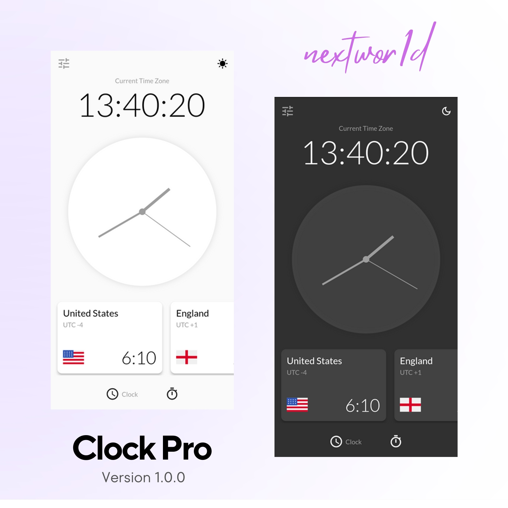

  

   
  
  
  
  
  

# Clock Pro v1.0.0

- Display the current local time accurately. Upon opening the app, users are greeted with a clean and elegant interface that prominently showcases the local time based on the device's location.

- In addition to the local time, the Clock App offers the functionality to view the time in five other time zones (USA, England, Germany, China, Japan).

- To enhance its utility further, the Clock App also includes a timer counter. Users can set a specific duration for the timer and start it with a single tap.

---

<<<<<<< HEAD
=======

>>>>>>> b2297bb566de5e7596a20f816259596ee2fd118b
